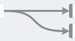

# Simpleline

## About

Simpleline is a simple and lightweight tool to draw lines and arrows between two html elements.

It was developed as a lightweight alternative for [LeaderLine](https://github.com/anseki/leader-line)
with a subset of the functions of LeaderLine. 

SimpleLine does one thing and does it well: It draws arrows between two html elements.
You can color the arrows by the CSS ```color``` attribute on the line's parent containers, or by setting it's parents



### Example
The **demo.html** file contains some examples of what simpleline does. Host it yourself on a local webserver to test,
or go click [here](https://raw.githack.com/miqraeng/simpleline/main/demo.html) to view the demo.

## Usage
SimpleLine is an ES module, so import it as follows in your existing ES modules

```js
import SimpleLine from 'simpleline'
```

Or use it in direct html like this.

```html
<script type="module">
    import SimpleLine from 'simpleline'
    // ... Your other code ...
</script>
```

Pass two HTML/SVG elements to `SimpleLine` constructor. Then a line with arrow is drawn between those elements.
You can also pass the html id of those elements and the constructor will look up the html elements

```js
const line = new SimpleLine(startElement, endElement, options);
```


### Options
**options** is an object with any of the following properties. Shown are the default values used if you don't specify them
```js
{
    autorefresh: 10, // Set the refresh timer for auto postion refresh (set to 0 to disable)
    class: "",  // Add an extra class to the line's container element here
    color: "",  // Set the color style of the line and arrow. 
                // Leave empty (or set to invalid)  makes it inherit the color from parent container 'color' css property.
    anchors: {  // Specify Where the line connects to the element
                // an array consisting of  'top', 'middle' or 'bottom' in one element for vertical alignement
                // and consisting of 'left', 'center', 'right' in the other element for horizontal alignment
        start: ["middle","right"],  // Line anchor for the start element
        end: ["middle", "left"],    // Line anchor for the end element
    },
    gravity: {  // Pull strength of the line into the direction of the anchors specified above
                // Increasing this value makes the line go for a longer stretch into the initial direction
                // Decreasing this value makes the line divert its course to curve to the other element quicker.
        start: 1,   // Pull strength of the start anchor
        end: 1,     // Pull strength of the end anchor
    },
    stroke: "4px", // Line thickness. Size of the arrow will adjust according to the stroke thickness
};
```

### Functions
The simpleline object has two functions intended for public use:

- **update()** Repaints the line with the current position of the elements. USeful if ```autorefresh``` is off
- **remove()** Removes the line from the dom

## Features

### Scroll safe
SimpleLine is scroll safe, but results are best if 
1. both start and end elements are in the same scroll area
2. the scroll area is marked as a [containing block](https://developer.mozilla.org/en-US/docs/Web/CSS/Containing_block#identifying_the_containing_block). 
   For example by using one if the CSS ```position``` properties in it's style. 
   
The line element wille be drawn in the closest containing block that contains both elements

### Auto repositioning
Once you draw the line, the position of the html elements it connects with a line is tracked by the SimpleLine object.
Upon a change in position in one of the elements, the line element is updated to reflect the changes.

This also means that you can use Simple Line to connect to dragging elements while dragging.

